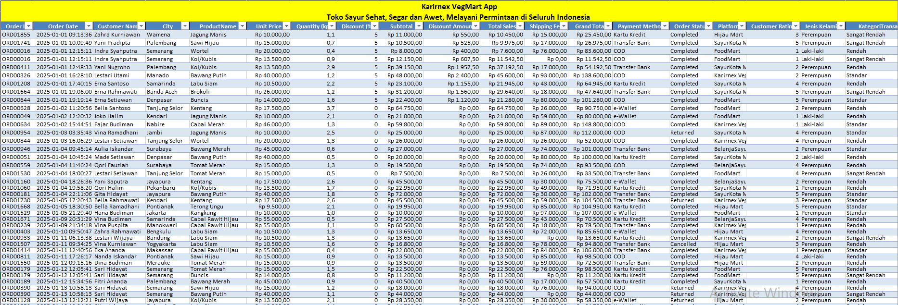
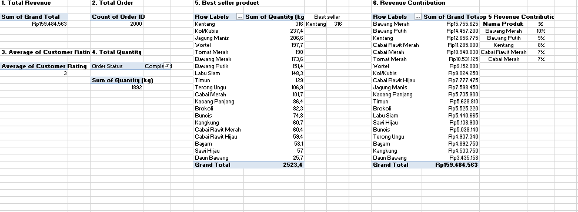
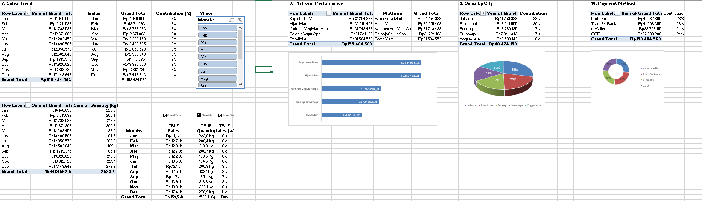
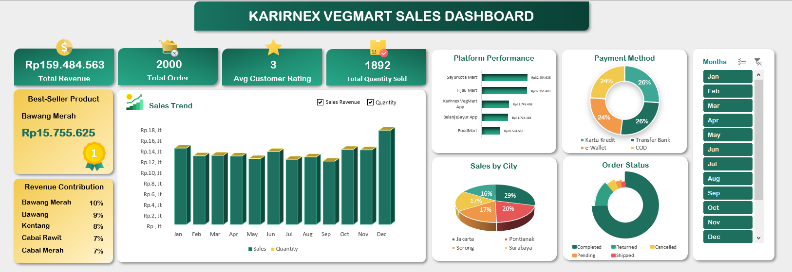

# VegMart Sales Performance Dashboard
Project ini merupakan dashboard analitik penjualan untuk platform e-commerce sayuran Karirnex VegMart yang beroperasi di seluruh Indonesia. Dataset ini berisi 2.000 transaksi selama periode Januari – Desember 2025, yang diolah menjadi dashboard interaktif untuk mendukung pengambilan keputusan bisnis di industri ritel produk segar.
# VegMart Sales Dashboard

## Project Overview

VegMart Sales Dashboard merupakan personal project untuk mengolah dan menganalisis data transaksi penjualan sayuran menggunakan Microsoft Excel. Project ini dibuat untuk mengubah data transaksi menjadi informasi yang lebih mudah dipantau melalui dashboard interaktif, dengan fokus pada performa penjualan, produk, tren penjualan, platform, wilayah, metode pembayaran, dan status pesanan.

Project menggunakan 2.000 data transaksi dengan periode Januari–Desember 2025. Hasil analisis kemudian disajikan dalam bentuk KPI, Pivot Table, dan visualisasi dashboard untuk membantu melihat pola serta performa penjualan secara lebih cepat.

> **Jenis Project:** Personal Project / Dummy Dataset
> **Fokus:** Sales Analysis & Dashboard
> **Tools:** Microsoft Excel

## Business Problem

Data transaksi penjualan yang terdiri dari berbagai informasi seperti tanggal, produk, jumlah pembelian, harga, diskon, platform, kota, metode pembayaran, dan status pesanan perlu diolah terlebih dahulu agar dapat digunakan untuk mengevaluasi performa penjualan.

Tanpa adanya rangkuman dan visualisasi, informasi mengenai produk dengan penjualan tertinggi, tren revenue, kontribusi platform, serta wilayah dengan performa penjualan terbesar akan lebih sulit diidentifikasi.

## Objective

Project ini bertujuan untuk mengolah data transaksi menjadi dashboard penjualan yang dapat digunakan untuk memantau performa revenue dan jumlah transaksi, mengidentifikasi produk dengan kontribusi penjualan terbesar, melihat tren penjualan bulanan, serta membandingkan performa berdasarkan platform, kota, metode pembayaran, dan status pesanan.

## Dataset

Dataset terdiri dari **2.000 transaksi penjualan** dengan periode Januari–Desember 2025.



Beberapa informasi utama dalam dataset meliputi:

* Order ID
* Order Date
* Customer Name
* City
* Product Name
* Unit Price
* Quantity (kg)
* Discount
* Total Sales
* Shipping Fee
* Grand Total
* Payment Method
* Order Status
* Platform
* Customer Rating
* Jenis Kelamin
* Kategori Transaksi

Selain data transaksi, project juga memiliki tabel referensi harga sebagai data pendukung.

## Data Preparation

Tahapan pengolahan data meliputi:

* Pemeriksaan struktur dan kelengkapan data transaksi
* Pengolahan nilai penjualan berdasarkan harga dan quantity
* Perhitungan subtotal, discount amount, total sales, dan grand total
* Pengelompokan transaksi berdasarkan kategori nilai transaksi
* Pengolahan data untuk kebutuhan analisis menggunakan Pivot Table
* Penggunaan tabel referensi harga sebagai data pendukung

## Analysis Method

Analisis dilakukan menggunakan **Pivot Table dan Pivot Chart** untuk menghasilkan beberapa metrik dan perspektif penjualan, yaitu:




* Total Revenue
* Total Order
* Total Quantity
* Rata-rata Customer Rating
* Produk dengan penjualan tertinggi
* Kontribusi revenue berdasarkan produk
* Tren penjualan bulanan
* Performa berdasarkan platform
* Penjualan berdasarkan kota
* Distribusi metode pembayaran
* Distribusi status pesanan

## Dashboard

Dashboard digunakan untuk memberikan ringkasan performa penjualan dalam satu tampilan sehingga informasi utama dapat dipantau dengan lebih cepat.

Dashboard mencakup indikator dan visualisasi mengenai:

* Total Revenue
* Total Order
* Total Quantity
* Customer Rating
* Best Seller Product
* Sales Trend
* Revenue Contribution
* Platform Performance
* Sales by City
* Payment Method
* Order Status

## Key Insights

Berdasarkan hasil analisis:

* Total revenue mencapai **Rp159,48 juta** dari **2.000 transaksi**.
* Total quantity yang terjual mencapai **2.523,4 kg**.
* **Kentang** menjadi produk dengan quantity terjual tertinggi, yaitu **316 kg**.
* Berdasarkan revenue produk, **Bawang Merah** memberikan kontribusi terbesar dengan sekitar **9,88%** dari total revenue.
* Penjualan tertinggi terjadi pada **Desember**, dengan revenue sekitar **Rp17,45 juta** dan quantity **276,9 kg**.
* **SayurKota Mart** menjadi platform dengan revenue tertinggi, sekitar **Rp32,25 juta**.
* **Jakarta** menjadi kota dengan kontribusi revenue terbesar, sekitar **29,09%**.
* **Completed** merupakan status pesanan dominan dengan **1.495 transaksi**.

## Tools & Skills

**Tools:**

* Microsoft Excel
* Pivot Table
* Pivot Chart
* Excel Formula
* Dashboard
* Data Validation / Slicer

**Skills:**

* Data Cleaning
* Data Preparation
* Data Analysis
* KPI Calculation
* Data Visualization
* Dashboard Development
* Business Insight

## Project Result

Project menghasilkan dashboard penjualan yang merangkum performa bisnis dari berbagai perspektif dalam satu tampilan. Dashboard memungkinkan pengguna melihat kondisi penjualan secara lebih cepat serta mengidentifikasi produk, periode, platform, dan wilayah yang memberikan kontribusi terbesar terhadap revenue.

Project ini juga menunjukkan proses dari **data transaksi → pengolahan data → analisis → visualisasi → business insight** menggunakan Microsoft Excel.

## Project Structure

```text
VegMart-Sales-Dashboard/
│
├── VegMart Sales Dashboard.xlsx
├── README.md
│
└── screenshots/
    ├── dashboard.png
    ├── raw_data.png
    └── pivot_analysis_1.png
    └── pivot_analysis_2.png
```

## Limitations & Future Improvement

Dataset yang digunakan dalam project ini merupakan **dummy dataset**, sehingga hasil analisis belum merepresentasikan kondisi operasional perusahaan secara langsung.

Pengembangan selanjutnya dapat dilakukan dengan menggunakan data aktual, menambahkan analisis profit/margin dan customer segmentation, serta mengembangkan dashboard menggunakan tools seperti **Tableau atau Power BI** untuk kebutuhan analisis yang lebih kompleks.
